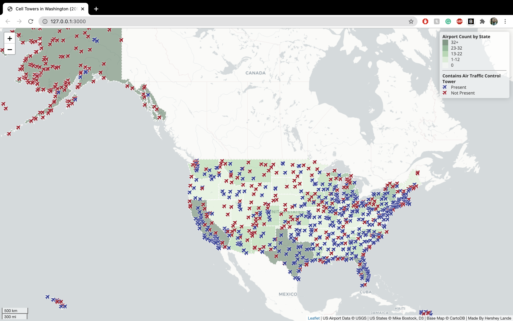

# Lab3

[Interact with the live map here!](https://support.west-wind.com)

This map highlights the different airports within the United States. Each of the states is given a different color of Green. A darker shade of green indicates more airports and vice versa. You can see that the states with larger cities and populations also tend to have a darker color of green. Secondly, the map uses the plane icon to identify the airport location. A blue airport icon represents an airport with a Control Tower and a red icon represent an airport without one. Another common trend to notice is that airports with a control tower tend to be in larger cities.

## Primary Functions
A lot of the functions of this map are based on stylistic choices. Firstly, the base of this map was acquired from CartoDB, the colors chosen for the icons and the states was acquired through Color Brewer. The color for the icons was based on the property field of CNTRL TWR and the count of the airports per state was used based on the counts of each of them within the state. The main index.html file is based off of leaflet. The legend stylistic choices are also created using leaflet. Leaflet also allows you to zoom in and out.  By simply clicking on the airport markers themselves, you are given the name of the airport.

## References
- Airport Data: Data.gov 2017 Data
- State Boundary Data: Mike Bostock of D3
